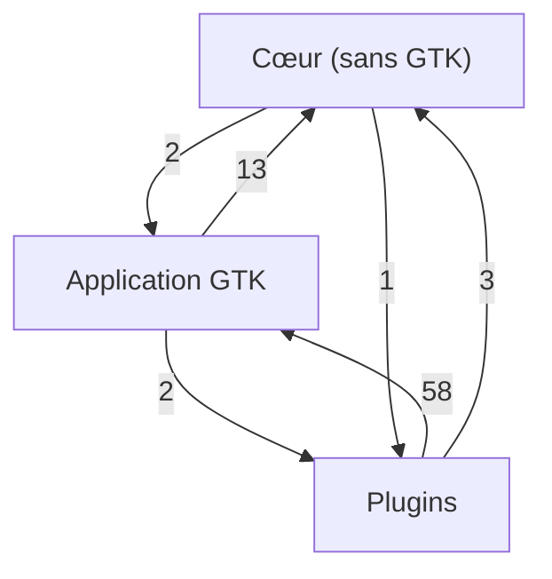

<!-- FICHIER GÉNÉRÉ par scripts/generate_class_diagram.py -- NE PAS ÉDITER À LA MAIN. -->

# GCM — diagramme de classes

> **Fichier généré depuis le code** par `scripts/generate_class_diagram.py` (issue #175) :
> toute modification manuelle sera écrasée. Le régénérer avec `make class-diagram` ;
> le job Qualité échoue s'il est périmé (`--check`).

46 modules · 111 classes · 187 fonctions publiques de module.

Conventions : `+` public, `-` privé (préfixe `_`) ; `list~str~` = `list[str]` ; `<<module>>`
regroupe les fonctions publiques d'un module ; `<<…>>` sur une classe liste `dataclass` et les
bases définies hors du bloc. Les méthodes privées et les classes imbriquées ne sont pas
représentées. Périmètre : racine, `plugins/` et `src/gcm4/` (hors tests, outils et sous-projets).

## Dépendances entre groupes

Nombre d'instructions `import` d'un groupe vers un autre. Le cœur n'importe ni GTK ni plugin
(`tests/test_architecture_imports.py`).

## Cœur (sans GTK)

| Module | Fichier | Rôle |
|---|---|---|
| `folder_context_menu_core` | `folder_context_menu_core.py` | Logique metier pure du menu contextuel du panneau de serveurs (zero import Gtk/Gio). |
| `gcm4_core` | `gcm4_core.py` | Logique métier de GNOME Connection Manager — zéro dépendance GTK. |
| `gesture_trigger_core` | `gesture_trigger_core.py` | Logique métier pure du déclenchement des menus contextuels (zéro import Gtk/Gio). |
| `inline_editor_core` | `inline_editor_core.py` | Logique métier pure de l'éditeur inline `CellTextView` (`widgets.py`, zéro import Gtk). |
| `logging_config` | `logging_config.py` | logging_config -- configuration centrale de loguru (issue #130, sous-issue 4a). |
| `master_password_core` | `master_password_core.py` | Protection par mot de passe maître du fichier de clé locale (``KEY_FILE``). |
| `netmiko_bulk_core` | `netmiko_bulk_core.py` | Cœur métier (sans GTK) du plugin de déploiement de configuration en masse via Netmiko pour GCM. |
| `popup_menu_core` | `popup_menu_core.py` | Logique metier pure du menu contextuel du terminal (zero import Gtk/Gio/Vte). |
| `putty_import_core` | `putty_import_core.py` | Cœur métier (sans GTK) de l'import de sessions PuTTY pour GCM. |
| `snmp_bulk_core` | `snmp_bulk_core.py` | Cœur métier (sans GTK) du déploiement SNMP pour GCM. |
| `snmp_push_core` | `snmp_push_core.py` | Cœur métier (sans GTK) du déploiement de configuration en masse par SNMP. |
| `tab_context_menu_core` | `tab_context_menu_core.py` | Logique metier pure du menu contextuel des onglets (zero import Gtk/Gio/Vte). |

```mermaid
classDiagram
    class mod_folder_context_menu_core {
        <<module>>
        +build_folder_context_menu_layout(click_target)
        +should_show_protocol_items(click_target)
        +flatten_action_names(sections)
    }
    class mod_gcm4_core {
        <<module>>
        +migrate_legacy_config_dir(old_dir, new_dir) bool
        +dep_install_hint(pkg_debian, pkg_fedora, pkg_arch) str
        +bindtextdomain(app_name, locale_dir) None
        +setup_app_logger(config_dir, debug)
        +get_username() str None
        +get_password() str
        +load_encryption_key(key_file) None
        +initialise_encyption_key(key_file) None
        +xor(pw, str1) list~str~
        +encrypt_old(passw, string) str
        +decrypt_old(passw, string) str
        +encrypt(passw, string) str
        +decrypt(passw, string, version) str
        +color_to_hex(rgba, diff) str
        +proto_default_port(proto, plugin_registry) str
        +all_default_ports(plugin_registry) set~str~
        +compute_zoom_size(current_size, delta, minimum, maximum) float
        +resolve_cluster_command(text) str
        +mask_cluster_command(text) str
        +resolve_auto_close_tab(host_override, global_default) int
        +workspace_hosts(groups) list
        +serialize_open_tabs(open_hosts) list
        +parse_open_tabs(raw) list
        +resolve_host_specs(specs, groups) list
        +serialize_group_colors(color_map) str
        +parse_group_colors(raw) dict
        +resolve_group_color(group, color_map, default) str
        +resolve_connection_hook_command(template, host_name, host_address, host_group, protocol) str None
        +resolve_theme_mode(raw_mode) str
    }
    class mod_gesture_trigger_core {
        <<module>>
        +classify_tree_servers_press(button, n_press)
        +classify_terminal_click(button, n_press, ctrl_pressed, paste_on_right_click)
        +classify_tab_label_click(button, n_press)
    }
    class mod_inline_editor_core {
        <<module>>
        +classify_editor_key_press(keyval, state, shift_mask, control_mask, return_keyval, kp_enter_keyval, escape_keyval)
        +classify_editor_button_press(n_press)
    }
    class mod_logging_config {
        <<module>>
        +level_from_env() str
        +is_debug_level(level) bool
        +app_log_path(config_dir) str
        +configure_logging(level, config_dir, log_file, force)
        +enable_debug(level, config_dir)
        +current_level() str
        +log_files() list~str~
        +is_debug_enabled() bool
        +extract_debug_flag(argv) tuple~bool, list~str~~
        +add_debug_argument(parser) None
        +apply_debug_argument(args, config_dir) None
        +get_logger(name)
        +summarize(value, name) str
    }
    class mod_master_password_core {
        <<module>>
        +is_protected(key_file_content) bool
        +protect_key_file_content(raw_key, master_password) str
        +unlock_key_file_content(protected_content, master_password) str
        +rewrap_key_file_content(protected_content, old_master_password, new_master_password) str
        +remove_master_password_protection(protected_content, master_password) str
    }
    class InvalidMasterPasswordError {
        <<Exception>>
    }
    class CorruptedProtectedContentError {
        <<Exception>>
    }
    class mod_netmiko_bulk_core {
        <<module>>
        +iter_all_device_types() list~tuple~str, str, str~~
        +load_inventory(path) list~InventoryRow~
        +find_missing_variables(template_text, context) list~str~
        +render_template(template_text, context) str
        +scan_output_for_errors(output_text) list~str~
        +push_to_device(row, profile, rendered_config, save) PushResult
        +run_bulk_push(rows, profiles, template_text, log_dir, save, max_workers, on_row_start, on_row_done, cancel_event) list~PushResult~
        +summarize_results(results) dict
    }
    class DeviceProfile {
        <<dataclass>>
        +str name
        +str device_type
        +str vendor
        +str username
        +str password
        +str secret
        +int port
        +int timeout
        +str save_command
        +to_netmiko_kwargs(host) dict
    }
    class ProfileStore {
        +reload() None
        +get(name) DeviceProfile None
        +names() list~str~
        +all() list~DeviceProfile~
        +set(profile) None
        +delete(name) None
        +save() None
        +write_template(path)$ None
    }
    class netmiko_bulk_core_InventoryRow {
        <<dataclass>>
        +str ip
        +str profile_name
        +dict~str, str~ variables
        +int line_no
        +render_context() dict~str, str~
    }
    class netmiko_bulk_core_PushResult {
        <<dataclass>>
        +InventoryRow row
        +str status
        +str output
        +str error
        +list~str~ config_errors
        +str log_path
        +float duration_s
        +ok() bool
    }
    class PushResultLike {
        <<Protocol>>
        +InventoryRow row
        +str status
        +str output
        +str error
        +list~str~ config_errors
        +str log_path
        +float duration_s
    }
    class mod_popup_menu_core {
        <<module>>
        +compute_enabled_actions(has_selection, multi_pane, has_split_notebook)
        +select_command_shortcuts(shortcuts)
        +format_command_label(shortcut, command, max_command_length)
        +flatten_action_names(sections)
    }
    class mod_putty_import_core {
        <<module>>
        +decode_putty_session_name(raw_filename) str
        +parse_putty_session_file(path) dict~str, str~
        +putty_session_to_row(session_name, raw) tuple~dict~str, str~ None, str None~
        +scan_putty_sessions(directory) tuple~list~dict~str, str~~, list~str~~
    }
    class mod_snmp_bulk_core {
        <<module>>
        +load_inventory(csv_path) list~InventoryRow~
        +find_missing_variables(template, available) set~str~
        +render_template(template, variables) str
        +push_to_device(row, profile, rendered_config, log_dir, server_ip) PushResult
        +run_bulk_push(rows, profiles, template_text, log_dir, max_workers, on_row_start, on_row_done, cancel_event, server_ip) list~PushResult~
        +summarize_results(results) dict~str, int~
    }
    class SnmpAuth {
        <<dataclass>>
        +str version
        +str community
        +str None username
        +str None auth_password
        +str auth_protocol
        +str None priv_password
        +str priv_protocol
        +str security_level
        +session_kwargs(host, port, timeout, retries) dict
    }
    class SnmpProfile {
        <<dataclass>>
        +str name
        +str vendor
        +SnmpAuth auth
        +int port
        +int timeout
        +int retries
        +float poll_interval
        +float poll_timeout
    }
    class snmp_bulk_core_SnmpProfileStore {
        +load() None
        +save() None
        +get(name) SnmpProfile None
        +all() list~SnmpProfile~
        +set(name, profile) None
        +delete(name) None
    }
    class snmp_bulk_core_InventoryRow {
        <<dataclass>>
        +int line_no
        +str ip
        +str profile_name
        +dict~str, str~ variables
    }
    class snmp_bulk_core_PushResult {
        <<dataclass>>
        +InventoryRow row
        +str status
        +str error
        +str log_path
        +float duration_s
    }
    class SnmpDriver {
        +str vendor_id
        +str display_name
        +push(host, server_ip, filename, username, password) tuple~bool, str~
    }
    class H3cComwareDriver {
        +push(host, server_ip, filename, username, password) tuple~bool, str~
    }
    SnmpDriver <|-- H3cComwareDriver
    class snmp_bulk_core_CiscoConfigCopyDriver {
        +push(host, server_ip, filename, username, password) tuple~bool, str~
    }
    SnmpDriver <|-- snmp_bulk_core_CiscoConfigCopyDriver
    class HuaweiVrpDriver {
        +push(host, server_ip, filename, username, password) tuple~bool, str~
    }
    SnmpDriver <|-- HuaweiVrpDriver
    class mod_snmp_push_core {
        <<module>>
        +upload_config_file(cfg, filename, content) None
        +iter_driver_choices() list~tuple~str, str~~
        +push_config_via_snmp(row, profile, rendered_config, transfer, poll_timeout_s, poll_interval_s) SnmpPushResult
        +run_bulk_snmp_push_async(rows, profiles, template_text, transfer, log_dir, max_workers, on_row_start, on_row_done, cancel_event) list~SnmpPushResult~
        +run_bulk_snmp_push(rows, profiles, template_text, transfer, log_dir, max_workers, on_row_start, on_row_done, cancel_event) list~SnmpPushResult~
    }
    class FileTransferConfig {
        <<dataclass>>
        +str protocol
        +str host
        +int port
        +str username
        +str password
        +str remote_dir
        +default_port() int
    }
    class SnmpCredentials {
        <<dataclass>>
        +str version
        +str community
        +str username
        +str auth_protocol
        +str auth_key
        +str priv_protocol
        +str priv_key
        +build_session_kwargs(hostname, port, timeout, retries) dict
    }
    class _PollOutcome {
        <<dataclass>>
        +bool done
        +bool ok
        +str detail
    }
    class SnmpPushDriver {
        <<ABC>>
        +str vendor_id
        +str display_name
        +tuple~str, ...~ supported_fetch_protocols
        +build_push_operations(index, filename, server_host, protocol, username, password) list~tuple~str, str, str~~
        +poll_status(session, row_index) _PollOutcome
    }
    class Hh3cComwareDriver {
        +build_push_operations(index, filename, server_host, protocol, username, password)
        +poll_status(session, row_index) _PollOutcome
    }
    SnmpPushDriver <|-- Hh3cComwareDriver
    class snmp_push_core_CiscoConfigCopyDriver {
        +build_push_operations(index, filename, server_host, protocol, username, password)
        +poll_status(session, row_index) _PollOutcome
    }
    SnmpPushDriver <|-- snmp_push_core_CiscoConfigCopyDriver
    class SnmpDeviceProfile {
        <<dataclass>>
        +str name
        +str vendor_id
        +SnmpCredentials snmp
        +int port
        +float timeout
        +driver() SnmpPushDriver
    }
    class snmp_push_core_SnmpProfileStore {
        +reload() None
        +get(name) SnmpDeviceProfile None
        +names() list~str~
        +all() list~SnmpDeviceProfile~
        +set(profile) None
        +delete(name) None
        +save() None
    }
    class SnmpPushResult {
        <<dataclass>>
        +InventoryRow row
        +str status
        +str output
        +str error
        +list~str~ config_errors
        +str log_path
        +float duration_s
        +ok() bool
    }
    class mod_tab_context_menu_core {
        <<module>>
        +build_tab_context_menu_layout(is_active, multi_pane)
        +flatten_action_names(sections)
    }
```

## Application GTK

| Module | Fichier | Rôle |
|---|---|---|
| `gnome_connection_manager` | `gnome_connection_manager.py` | GNOME Connection Manager - Terminal-based SSH/RDP/VNC/SPICE client manager. |
| `hypervisor_import_common` | `hypervisor_import_common.py` | Helpers partagés par les imports hyperviseurs (libvirt / Proxmox). |
| `key_picker_dialog` | `key_picker_dialog.py` | Dialogue de sélection de clé SSH existante depuis ~/.ssh/. |
| `models` | `models.py` | Modèles de données pour les hôtes et utilitaires de configuration. |
| `pyAES` | `pyAES.py` | AES encryption/decryption implementation in pure Python. |
| `ssh_config_editor` | `ssh_config_editor.py` | Dialogue GTK3 d'édition de ~/.ssh/config intégré à GCM. |
| `ssh_key_manager_dialog` | `ssh_key_manager_dialog.py` | Gestionnaire de clés SSH : liste, génération, import, suppression, copie. |
| `urlregex` | `urlregex.py` | Expressions régulières PCRE2 utilisées par GCM pour la détection d'URLs. |
| `utils` | `utils.py` | Utilitaires généraux et classe de base GTK pour l'application GCM. |
| `widgets` | `widgets.py` | Widgets GTK personnalisés pour l'interface GCM. |

```mermaid
classDiagram
    class mod_gnome_connection_manager {
        <<module>>
        +bindtextdomain(app_name, locale_dir)
        +msgbox(text, parent)
        +msgconfirm(text)
        +send_desktop_notification(summary, body)
        +run_pre_connect_hook(host)
        +resolve_post_connect_command(host, proto)
        +msginfo(text)
        +inputbox(title, text, default, password)
        +show_font_dialog(parent, title, button)
        +parse_color_rgba(spec)
        +parse_color(spec)
        +set_widget_font(widget, font_desc)
        +color_to_hex(rgba, diff)
        +get_key_name(event)
        +get_username()
        +get_password()
        +load_encryption_key()
        +initialise_encyption_key()
        +xor(pw, str1)
        +encrypt_old(passw, string)
        +decrypt_old(passw, string)
        +encrypt(passw, string)
        +decrypt(passw, string)
        +vte_feed(terminal, data)
        +get_serial_templates()
        +set_serial_templates(templates)
        +reset_serial_templates()
        +main()
    }
    class SerialTemplatesTab {
        +apply()
    }
    class Wmain {
        <<Gtk.Window>>
        +get_widget(name)
        +update_visual()
        +enable_window_transparency(window)
        +new()
        +check_updates()
        +attach_terminal_click_gesture(widget)
        +on_terminal_pressed(gesture, n_press, x, y, widget)
        +on_terminal_keypress(widget, event, *args)
        +terminal_zoom(widget, delta, reset)
        +on_terminal_selection(widget, *args)
        +find_word(backwards)
        +init_search()
        +chunkstring(string, length)
        +on_popupmenu(widget, item, *args)
        +createMenu()
        +on_mnu_export_csv_activate(widget, *args)
        +on_mnu_export_json_activate(widget, *args)
        +on_mnu_dark_mode_toggled(widget, *args)
        +terminal_copy(terminal)
        +terminal_paste(terminal)
        +terminal_copy_paste(terminal)
        +terminal_select_all(terminal)
        +terminal_copy_all(terminal)
        +on_menuCopy_activate(widget)
        +on_menuPaste_activate(widget)
        +on_menuCopyPaste_activate(widget)
        +on_menuSelectAll_activate(widget)
        +on_menuCopyAll_activate(widget)
        +on_menuSettings_activate(widget)
        +on_output_written(terminal, data)
        +on_contents_changed(terminal)
        +set_terminal_logger(terminal, enable_logging, continuous_mode)
        +registerUrlRegexes(terminal)
        +registerUrlRegex(terminal, regex)
        +open_management_tab(key, title, factory)
        +close_management_tab(tab_key)
        +addTab(notebook, host)
        +send_data(terminal, data)
        +initLeftPane()
        +on_treeServers_tooltip(widget, x, y, keyboard, tooltip)
        +add_shortcut(cp, scuts, command, name, default)
        +loadConfig()
        +is_node_collapsed(model, path, iter, nodes)
        +get_collapsed_nodes()
        +set_collapsed_nodes()
        +servers_background_color()
        +updateTree()
        +update_row_color(node)
        +get_folder(obj, folder, path)
        +writeConfig()
        +on_tab_scroll(notebook, event)
        +on_tab_focus(widget, tab, *args)
        +split_notebook(direction)
        +find_notebook(widget, exclude)
        +find_active_terminal(widget)
        +check_notebook_pages(widget)
        +on_page_removed(widget, *args)
        +on_page_added(widget, *args)
        +show_save_buffer(terminal)
        +set_panel_visible(visibility)
        +on_wMain_destroy(widget, *args)
        +on_wMain_delete_event(widget, *args)
        +on_guardar_como1_activate(widget, *args)
        +on_importar_servidores1_activate(widget, *args)
        +on_exportar_servidores1_activate(widget, *args)
        +on_salir1_activate(widget, *args)
        +on_show_panel_toggled(widget, *args)
        +on_acerca_de1_activate(widget, *args)
        +on_double_click(widget, event, *args)
        +on_btnLocal_clicked(widget, *args)
        +on_btnConnect_clicked(widget, *args)
        +on_btnAdd_clicked(widget, *args)
        +get_group(i)
        +on_bntEdit_clicked(widget, *args)
        +on_btnDel_clicked(widget, *args)
        +on_btnHSplit_clicked(widget, *args)
        +on_btnVSplit_clicked(widget, *args)
        +on_btnUnsplit_clicked(widget, *args)
        +on_btnConfig_clicked(widget, *args)
        +on_btnSearchBack_clicked(widget, *args)
        +on_btnSearch_clicked(widget, *args)
        +on_btnSearch_key_press(widget, event, *args)
        +on_btnCluster_clicked(widget, *args)
        +on_open_workspace_clicked(widget, *args)
        +on_hpMain_button_press_event(widget, event, *args)
        +on_tvServers_row_activated(widget, *args)
        +on_tvServers_row_collapsed(widget, *args)
        +on_tvServers_row_expanded(widget, *args)
        +on_tvServers_style_updated(widget, *args)
        +on_tvServers_pressed(gesture, n_press, x, y)
    }
    GCMBase <|-- Wmain
    class Whost {
        <<Gtk.Dialog>>
        +get_widget(name)
        +new()
        +init(group, host)
        +update_texttags(*args)
        +on_cancelbutton1_clicked(widget, *args)
        +on_okbutton1_clicked(widget, *args)
        +on_cmbType_changed(widget, *args)
        +on_chkCommands_toggled(widget, *args)
        +on_btnBColor_clicked(widget, *args)
        +on_chkDefaultColors_toggled(widget, *args)
        +on_btnFColor_clicked(widget, *args)
        +on_btnBrowse_clicked(widget, *args)
        +on_btnPickKey_clicked(widget, *args)
        +on_btnKeyManager_clicked(widget, *args)
    }
    GCMBase <|-- Whost
    class Wabout {
        <<Gtk.AboutDialog>>
        +on_wAbout_close(widget, *args)
    }
    GCMBase <|-- Wabout
    class Wconfig {
        <<Gtk.Dialog>>
        +new()
        +addParam(name, field, ptype, *args)
        +on_edited(widget, rownum, value, model, colnum)
        +on_editing_started(widget, entry, rownum, model, colnum)
        +on_cancelbutton1_clicked(widget, *args)
        +on_okbutton1_clicked(widget, *args)
        +on_btnBColor_clicked(widget, *args)
        +on_btnFColor_clicked(widget, *args)
        +on_chkDefaultColors_toggled(widget, *args)
        +on_chkDefaultFont_toggled(widget, *args)
        +on_btnFont_clicked(widget, *args)
        +on_treeCommands_key_press_event(widget, event, *args)
    }
    GCMBase <|-- Wconfig
    class Wcluster {
        <<Gtk.Dialog>>
        +new()
        +on_active_toggled(widget, path)
        +change_color(term, activate)
        +on_wCluster_destroy(widget, *args)
        +on_tab_will_close()
        +on_cancelbutton2_clicked(widget, *args)
        +on_btnAll_clicked(widget, *args)
        +on_btnNone_clicked(widget, *args)
        +on_btnInvert_clicked(widget, *args)
        +send_cluster_commands(widget)
        +on_txtCommands_key_press_event(widget, event, *args)
        +on_btnExecuteCluster_clicked(widget, *args)
    }
    GCMBase <|-- Wcluster
    class CheckUpdates {
        <<Thread>>
        +msg(text, parent)
        +on_clicked(*args)
        +run()
    }
    class mod_hypervisor_import_common {
        <<module>>
        +dep_install_hint(pkg_debian, pkg_fedora, pkg_arch)
        +vm_name_split(vm_name)
        +collect_ssh_keys()
        +paramiko_connect(hostname, port, username, log_fn)
        +libvirt_get_uris_from_dconf()
        +libvirt_ssh_run(client, cmd, timeout)
        +libvirt_nmap_scan(client, run_fn, log_fn)
        +check_port_open(client, run_fn, ip, port, timeout)
    }
    class KeyPickerDialog {
        <<Gtk.Dialog>>
        -dict __gsignals__
    }
    class Host {
        +tunnel_as_string()
        +clone()
    }
    class HostUtils {
        +get_val(cp, section, name, default)$
        +load_host_from_ini(cp, section, pwd)$
        +save_host_to_ini(cp, section, host, pwd)$
    }
    class mod_pyAES {
        <<module>>
        +rotate(word, n)
        +shiftRows(state)
        +shiftRowsInv(state)
        +keyScheduleCore(word, i)
        +expandKey(cipherKey)
        +subBytes(state)
        +subBytesInv(state)
        +addRoundKey(state, roundKey)
        +galoisMult(a, b)
        +mixColumn(column)
        +mixColumnInv(column)
        +mixColumns(state)
        +mixColumnsInv(state)
        +aesRound(state, roundKey)
        +aesRoundInv(state, roundKey)
        +createRoundKey(expandedKey, n)
        +passwordToKey(password)
        +aesMain(state, expandedKey, numRounds)
        +aesMainInv(state, expandedKey, numRounds)
        +aesEncrypt(plaintext, key)
        +aesDecrypt(ciphertext, key)
        +getBlock(fp)
        +encrypt(text, password)
        +decrypt(text, password)
    }
    class SshConfigEditorDialog {
        <<Gtk.Dialog>>
        +save() None
    }
    GCMBase <|-- SshConfigEditorDialog
    class _SshTestDialog {
        <<Gtk.Dialog>>
    }
    class mod_ssh_key_manager_dialog {
        <<module>>
        +get_default_ssh_key_comment() str
    }
    class SSHTargetSpec {
        <<dataclass>>
        +str user
        +str host
        +int port
        +display() str
        +ssh_base_cmd() list~str~
    }
    class _FSAdapter {
        +is_remote() bool
        +label() str
        +target_user() str
        +read_text(filename) str None
        +write_text(filename, content, mode) bool
        +test_connection() tuple~bool, str~
    }
    class _LocalFS {
        +is_remote() bool
        +label() str
        +target_user() str
        +read_text(filename) str None
        +write_text(filename, content, mode) bool
    }
    _FSAdapter <|-- _LocalFS
    class _RemoteFS {
        +is_remote() bool
        +label() str
        +target_user() str
        +read_text(filename) str None
        +write_text(filename, content, mode) bool
        +test_connection() tuple~bool, str~
    }
    _FSAdapter <|-- _RemoteFS
    class _GenerateKeyDialog {
        <<Gtk.Dialog>>
        +get_options() dict~str, str int bool~
    }
    class _AddAuthorizedKeyDialog {
        <<Gtk.Dialog>>
        +get_key_line() str
    }
    class _TestKnownHostsDialog {
        <<Gtk.Dialog>>
    }
    class _RenameKeyDialog {
        <<Gtk.Dialog>>
        +get_new_name() str
    }
    class _ChangePassphraseDialog {
        <<Gtk.Dialog>>
        +get_values() tuple~str, str, str~
    }
    class _ViewPublicKeyDialog {
        <<Gtk.Dialog>>
    }
    class SSHKeyManagerDialog {
        <<Gtk.Window>>
        +has_designated_ca() bool
    }
    GCMBase <|-- SSHKeyManagerDialog
    class mod_utils {
        <<module>>
        +run_dialog_sync(dialog) Gtk.ResponseType
        +show_open_dialog(parent, title, action, last_path_holder)
        +msgbox(text, parent, icon_path)
        +embed_dialog_content(gcm_instance)
    }
    class GCMBase {
        +request_close()
        +on_tab_will_close()
        +new()
        +run()
    }
    class conf
    class mod_widgets {
        <<module>>
        +build_remote_desktop_context_menu(btn_connect, btn_disconnect, send_special_keys_fn, extra_items)
        +mount_iso_temp(iso_path)
        +umount_iso_temp(loop_device)
        +vte_run(terminal, command, arg, extra_env)
        +inputbox(title, text, default, password, parent, icon_path)
    }
    class ManagementTabLabel {
        <<Gtk.Box>>
        +get_text()
    }
    class _LogActionShim {
        +get_active()
        +set_active(value)
    }
    class TabContextMenu {
        +rebuild(is_active, multi_pane, log_active)
        +popup_at(relative_to, x, y)
    }
    class FolderContextMenu {
        +rebuild(click_target)
        +popup_at(relative_to, x, y)
    }
    class PopupMenu {
        +rebuild(has_selection, multi_pane, has_split_notebook, log_active)
        +populate_commands(commands)
        +popup_at(relative_to, x, y)
        +popup_commands_at(relative_to)
    }
    class NotebookTabLabel {
        <<Gtk.Box>>
        +set_selected(sel)
        +on_close_tab(widget, notebook, *args)
        +close_tab(widget)
        +mark_tab_as_closed()
        +effective_auto_close_tab()
        +mark_tab_as_active()
        +get_text()
        +on_label_pressed(gesture, n_press, x, y)
    }
    class EntryDialog {
        <<Gtk.Dialog>>
        +quit(w, event)
        +click(button)
    }
    class CellTextView {
        <<Gtk.TextView, Gtk.CellEditable>>
        +do_editing_done(*args)
        +do_remove_widget(*args)
        +do_start_editing(*args)
        +get_text()
        +set_text(text)
    }
    class MultilineCellRenderer {
        <<Gtk.CellRendererText>>
        +do_start_editing(event, widget, path, bg_area, cell_area, flags)
    }
```

## Plugins

| Module | Fichier | Rôle |
|---|---|---|
| `plugins.plugin_base` | `plugins/plugin_base.py` | Contrats plugin pour GCM. |
| `plugins.plugin_export_csv` | `plugins/plugin_export_csv.py` | Outil « Export to CSV » (BatchPlugin) pour GCM. |
| `plugins.plugin_export_json` | `plugins/plugin_export_json.py` | Outil « Export to JSON » (BatchPlugin) pour GCM. |
| `plugins.plugin_import_csv` | `plugins/plugin_import_csv.py` | Outil « Import from CSV » (BatchPlugin) pour GCM. |
| `plugins.plugin_import_json` | `plugins/plugin_import_json.py` | Outil « Import from JSON » (BatchPlugin) pour GCM. |
| `plugins.plugin_import_libvirt` | `plugins/plugin_import_libvirt.py` | Outil « Import from libvirt » (BatchPlugin) pour GCM. |
| `plugins.plugin_import_ovirt` | `plugins/plugin_import_ovirt.py` | Outil « Import from oVirt » (BatchPlugin) pour GCM. |
| `plugins.plugin_import_proxmox` | `plugins/plugin_import_proxmox.py` | Outil « Import from Proxmox » (BatchPlugin) pour GCM. |
| `plugins.plugin_import_putty` | `plugins/plugin_import_putty.py` | Outil « Import from PuTTY sessions » (BatchPlugin) pour GCM. |
| `plugins.plugin_import_virtualbox` | `plugins/plugin_import_virtualbox.py` | Outil « Import from VirtualBox » (BatchPlugin) pour GCM. |
| `plugins.plugin_ipmisol` | `plugins/plugin_ipmisol.py` | Plugin de connexion IPMI Serial-over-LAN (console BMC : iLO, iDRAC, IMM…). |
| `plugins.plugin_local` | `plugins/plugin_local.py` | Plugin de connexion "Local" (shell local, sans hôte distant). |
| `plugins.plugin_netmiko_push` | `plugins/plugin_netmiko_push.py` | Onglet « Netmiko » (déploiement de configuration en masse) pour GCM. |
| `plugins.plugin_rdp` | `plugins/plugin_rdp.py` | Plugin de connexion RDP (GtkFrdp.Display embarqué). |
| `plugins.plugin_serial` | `plugins/plugin_serial.py` | Plugin de connexion série (port local via picocom/minicom/screen). |
| `plugins.plugin_snmp_push` | `plugins/plugin_snmp_push.py` | Onglet « Push SNMP » (déploiement de configuration en masse par SNMP) pour GCM. |
| `plugins.plugin_spice` | `plugins/plugin_spice.py` | Plugin de connexion SPICE (SpiceClientGtk.Display natif, ou fallback subprocess). |
| `plugins.plugin_ssh` | `plugins/plugin_ssh.py` | Plugin de connexion SSH. |
| `plugins.plugin_telnet` | `plugins/plugin_telnet.py` | Plugin de connexion Telnet. |
| `plugins.plugin_vnc` | `plugins/plugin_vnc.py` | Plugin de connexion VNC (GtkVnc.Display natif, ou fallback subprocess). |
| `plugins.plugin_web` | `plugins/plugin_web.py` | Plugin de connexion Web (console BMC HTML5 : iLO/iDRAC/IMM, ou toute URL). |
| `plugins.pluginvnc2.vnc_tab` | `plugins/pluginvnc2/vnc_tab.py` | vnc_tab.py — Onglet VNC complet pour gnome-connection-manager (fork GTK4) |
| `plugins.ssh` | `plugins/ssh/__init__.py` | Plugin SSH — dossier pilote de la migration GTK4 (découpage par plugin). |
| `plugins.ssh.core` | `plugins/ssh/core.py` | Logique métier SSH de gcm4, zéro dépendance GTK — parsing de ``~/.ssh/config`` et migration/import des hôtes SSH de gcm.conf. |

```mermaid
classDiagram
    class ConnectionPlugin {
        <<ABC>>
        +str protocol_id
        +str display_name
        +int None default_port
        +str icon_name
        +int ui_order
        +bool is_terminal
        +bool self_scrolling
        +object None app
        +build_tab(host, get_password) Gtk.Widget
        +build_edit_page() Gtk.Widget
        +load_host_fields(host) None
        +save_host_fields(host) None
        +host_fields() list~tuple~str, object~~
        +build_folder_context_menu_items() list~tuple~str, Callable~~~, None~~~
        +validate() list~str~
        +menu_actions() list
        +patch_edit_host_dialog(builder, host_section, cp) None
    }
    class PluginRegistry {
        +register(plugin) None
        +get(protocol_id) ConnectionPlugin None
        +all() list~ConnectionPlugin~
        +all_sorted() list~ConnectionPlugin~
        +bind_app(app) None
        +protocol_ids() list~str~
        +all_host_fields() list~tuple~str, object~~
        +autoload(directory, package) list~str~
    }
    class BatchPlugin {
        <<ABC>>
        +str tool_id
        +str display_name
        +str icon_name
        +str menu_section
        +object None app
        +activate() None
    }
    class BatchPluginRegistry {
        +register(plugin) None
        +get(tool_id) BatchPlugin None
        +all() list~BatchPlugin~
        +bind_app(app) None
        +tool_ids() list~str~
        +autoload(directory, package) list~str~
    }
    class mod_plugins_plugin_export_csv {
        <<module>>
        +get_batch_plugin() CsvExportBatchPlugin
    }
    class CsvExportBatchPlugin {
        +activate() None
    }
    BatchPlugin <|-- CsvExportBatchPlugin
    class mod_plugins_plugin_export_json {
        <<module>>
        +get_batch_plugin() JsonExportBatchPlugin
    }
    class JsonExportBatchPlugin {
        +activate() None
    }
    BatchPlugin <|-- JsonExportBatchPlugin
    class mod_plugins_plugin_import_csv {
        <<module>>
        +get_batch_plugin() CsvImportBatchPlugin
    }
    class CsvImportBatchPlugin {
        +activate() None
    }
    BatchPlugin <|-- CsvImportBatchPlugin
    class mod_plugins_plugin_import_json {
        <<module>>
        +get_batch_plugin() JsonImportBatchPlugin
    }
    class JsonImportBatchPlugin {
        +activate() None
    }
    BatchPlugin <|-- JsonImportBatchPlugin
    class mod_plugins_plugin_import_libvirt {
        <<module>>
        +build_preferences_tab(notebook)
        +get_batch_plugin() LibvirtImportBatchPlugin
    }
    class LibvirtPrefsTab {
        +apply()
    }
    class LibvirtImportDialog {
        <<GCMBase>>
    }
    class LibvirtImportBatchPlugin {
        +activate() None
    }
    BatchPlugin <|-- LibvirtImportBatchPlugin
    class mod_plugins_plugin_import_ovirt {
        <<module>>
        +get_batch_plugin() OvirtImportBatchPlugin
    }
    class OvirtImportDialog {
        <<GCMBase>>
    }
    class OvirtImportBatchPlugin {
        +activate() None
    }
    BatchPlugin <|-- OvirtImportBatchPlugin
    class mod_plugins_plugin_import_proxmox {
        <<module>>
        +build_preferences_tab(notebook)
        +get_batch_plugin() ProxmoxImportBatchPlugin
    }
    class ProxmoxPrefsTab {
        +apply()
    }
    class ProxmoxImportDialog {
        <<GCMBase>>
    }
    class ProxmoxImportBatchPlugin {
        +activate() None
    }
    BatchPlugin <|-- ProxmoxImportBatchPlugin
    class mod_plugins_plugin_import_putty {
        <<module>>
        +get_batch_plugin() PuttyImportBatchPlugin
    }
    class PuttyImportBatchPlugin {
        +activate() None
    }
    BatchPlugin <|-- PuttyImportBatchPlugin
    class mod_plugins_plugin_import_virtualbox {
        <<module>>
        +build_preferences_tab(notebook)
        +get_batch_plugin() VirtualBoxImportBatchPlugin
    }
    class VirtualBoxPrefsTab {
        +apply()
    }
    class VirtualBoxImportDialog {
        <<GCMBase>>
    }
    class VirtualBoxImportBatchPlugin {
        +activate() None
    }
    BatchPlugin <|-- VirtualBoxImportBatchPlugin
    class mod_plugins_plugin_ipmisol {
        <<module>>
        +get_plugin() IpmiSolPlugin
    }
    class IpmiSolTab {
        <<Gtk.Box>>
        +connect_ipmi()
    }
    class IpmiSolPlugin {
        +build_tab(host, get_password) Gtk.Widget
        +build_edit_page() Gtk.Widget
        +load_host_fields(host) None
        +save_host_fields(host) None
    }
    ConnectionPlugin <|-- IpmiSolPlugin
    class mod_plugins_plugin_local {
        <<module>>
        +get_plugin() LocalPlugin
    }
    class LocalTab {
        <<Gtk.Box>>
        +connect_local() None
    }
    class LocalPlugin {
        +build_tab(host, get_password) Gtk.Widget
        +build_edit_page() Gtk.Widget
        +load_host_fields(host) None
        +save_host_fields(host) None
    }
    ConnectionPlugin <|-- LocalPlugin
    class mod_plugins_plugin_netmiko_push {
        <<module>>
        +open_netmiko_tab(wmain) NetmikoTab
        +get_batch_plugin() NetmikoPushBatchPlugin
    }
    class NetmikoTab {
        +get_root_widget() Gtk.Widget
    }
    class NetmikoPushBatchPlugin {
        +activate() None
    }
    BatchPlugin <|-- NetmikoPushBatchPlugin
    class mod_plugins_plugin_rdp {
        <<module>>
        +get_plugin() RdpPlugin
    }
    class FreeRdpTab {
        <<Gtk.Box>>
        +connect_rdp()
        +build_context_menu()
    }
    class RdpPlugin {
        +build_tab(host, get_password) Gtk.Widget
        +build_edit_page() Gtk.Widget
        +load_host_fields(host) None
        +save_host_fields(host) None
        +host_fields() list~tuple~str, object~~
    }
    ConnectionPlugin <|-- RdpPlugin
    class mod_plugins_plugin_serial {
        <<module>>
        +get_plugin() SerialPlugin
    }
    class SerialTab {
        <<Gtk.Box>>
        +connect_serial()
    }
    class SerialPlugin {
        +build_tab(host, get_password) Gtk.Widget
        +build_edit_page() Gtk.Widget
        +load_host_fields(host) None
        +save_host_fields(host) None
        +host_fields() list~tuple~str, object~~
    }
    ConnectionPlugin <|-- SerialPlugin
    class mod_plugins_plugin_snmp_push {
        <<module>>
        +open_snmp_push_tab(wmain) SnmpPushTab
        +get_batch_plugin() SnmpPushBatchPlugin
    }
    class SnmpPushTab {
        +get_root_widget() Gtk.Widget
    }
    class SnmpPushBatchPlugin {
        +activate() None
    }
    BatchPlugin <|-- SnmpPushBatchPlugin
    class mod_plugins_plugin_spice {
        <<module>>
        +mask_password(text) str
        +parse_spice_hosts(conf_path) list~tuple~str, str~~
        +get_plugin() SpicePlugin
    }
    class HostsUpdater {
        +update(pairs) int
    }
    class SpiceTab {
        <<Gtk.Box>>
        +connect_spice()
        +build_context_menu()
    }
    class SpicePlugin {
        +build_tab(host, get_password) Gtk.Widget
        +build_edit_page() Gtk.Widget
        +load_host_fields(host) None
        +save_host_fields(host) None
        +host_fields() list~tuple~str, object~~
    }
    ConnectionPlugin <|-- SpicePlugin
    class mod_plugins_plugin_ssh {
        <<module>>
        +get_plugin() SshPlugin
    }
    class SshTab {
        <<Gtk.Box>>
        +connect_ssh() None
    }
    class SshPlugin {
        +build_tab(host, get_password) Gtk.Widget
        +build_edit_page() Gtk.Widget
        +load_host_fields(host) None
        +save_host_fields(host) None
        +host_fields() list~tuple~str, object~~
        +validate() list~str~
        +menu_actions() list~tuple~str, str, Callable~~
        +build_folder_context_menu_items() list~tuple~str, Callable~~
        +edit_ssh_config() None
        +manage_ssh_keys() None
        +migrate_all_ssh() None
        +migrate_ssh_host(host) None
        +import_ssh_config_action() None
        +patch_edit_host_dialog(builder, host_section, cp) None
    }
    ConnectionPlugin <|-- SshPlugin
    class mod_plugins_plugin_telnet {
        <<module>>
        +get_plugin() TelnetPlugin
    }
    class TelnetTab {
        <<Gtk.Box>>
        +connect_telnet() None
    }
    class TelnetPlugin {
        +build_tab(host, get_password) Gtk.Widget
        +build_edit_page() Gtk.Widget
        +load_host_fields(host) None
        +save_host_fields(host) None
    }
    ConnectionPlugin <|-- TelnetPlugin
    class mod_plugins_plugin_vnc {
        <<module>>
        +get_plugin() VncPlugin
    }
    class plugins_plugin_vnc_VncTab {
        <<Gtk.Box>>
        +make_vnc_passwd(password, path) None
        +reverse_bits(b) int
        +connect_vnc()
        +build_context_menu()
    }
    class VncPlugin {
        +build_tab(host, get_password) Gtk.Widget
        +build_edit_page() Gtk.Widget
        +load_host_fields(host) None
        +save_host_fields(host) None
        +host_fields() list~tuple~str, object~~
    }
    ConnectionPlugin <|-- VncPlugin
    class mod_plugins_plugin_web {
        <<module>>
        +get_plugin() WebPlugin
    }
    class WebTab {
        <<Gtk.Box>>
        +connect_web()
    }
    class WebPlugin {
        +build_tab(host, get_password) Gtk.Widget
        +build_edit_page() Gtk.Widget
        +load_host_fields(host) None
        +save_host_fields(host) None
        +host_fields() list~tuple~str, object~~
        +validate() list~str~
    }
    ConnectionPlugin <|-- WebPlugin
    class mod_plugins_pluginvnc2_vnc_tab {
        <<module>>
        +build_vnc_tab_label(tab) Gtk.Box
    }
    class HostKeyStore {
        +get(host, port) Optional~rsa.RSAPublicKey~
        +set(host, port, key)
        +forget(host, port)
    }
    class VncConnectionInfo {
        <<dataclass>>
        +str name
        +str host
        +int port
        +Optional~str~ username
        +Optional~str~ password
        +Optional~int~ jpeg_quality
        +Optional~int~ compression_level
        +bool allow_indexed_colour
        +bool shared
        +Optional~list~ encodings
        +bool pin_host_key
        +bool sync_clipboard
        +bool invert_scroll
    }
    class VncStatus {
        <<enum.Enum>>
    }
    class VncDisplay {
        <<Gtk.Picture>>
        +start()
        +stop()
        +reconnect()
        +forget_host_key()
        +save_screenshot(path) bool
        +copy_screenshot_to_clipboard() bool
        +set_active_screen(screen_id)
        +send_ctrl_alt_del()
        +send_text(text)
        +toggle_scaling()
        +get_display_transform()
        +widget_to_remote(x, y)
        +set_continuous_updates(enable)
    }
    class plugins_pluginvnc2_vnc_tab_VncTab {
        <<Gtk.Box>>
        +close()
    }
    class mod_plugins_ssh_core {
        <<module>>
        +is_shared_target(path) bool
        +backup_file(path, shared) Path None
        +migrate_ssh_hosts(gcm_conf, ssh_config, dry_run, only_names) dict~str, list~str~~
        +import_ssh_config(source, gcm_conf, dry_run) dict~str, list~str~~
        +main(argv) int
    }
    class SSHOption {
        <<dataclass>>
        +str key
        +str value
        +str indentation
    }
    class SSHHost {
        <<dataclass>>
        +list~str~ patterns
        +list~SSHOption~ options
        +int start_line
        +int end_line
        +list~str~ raw_lines
        +from_raw_lines(lines)$ SSHHost
        +get_option(key) str None
        +set_option(key, value) None
        +remove_option(key) bool
        +get_options(key) list~str~
        +set_options(key, values) None
    }
    class SSHConfig {
        <<dataclass>>
        +Path file_path
        +list~SSHHost~ hosts
        +list~SSHOption~ global_options
        +list~str~ include_directives
        +dict~Path, list~str~~ includes_resolved
        +list~str~ original_lines
        +generate_content() str
        +is_dirty() bool
        +get_host(alias) SSHHost None
        +add_host(host) None
        +remove_host(host) bool
    }
    class SSHConfigParser {
        +parse() SSHConfig
        +write(backup) None
        +validate() list~str~
    }
```

